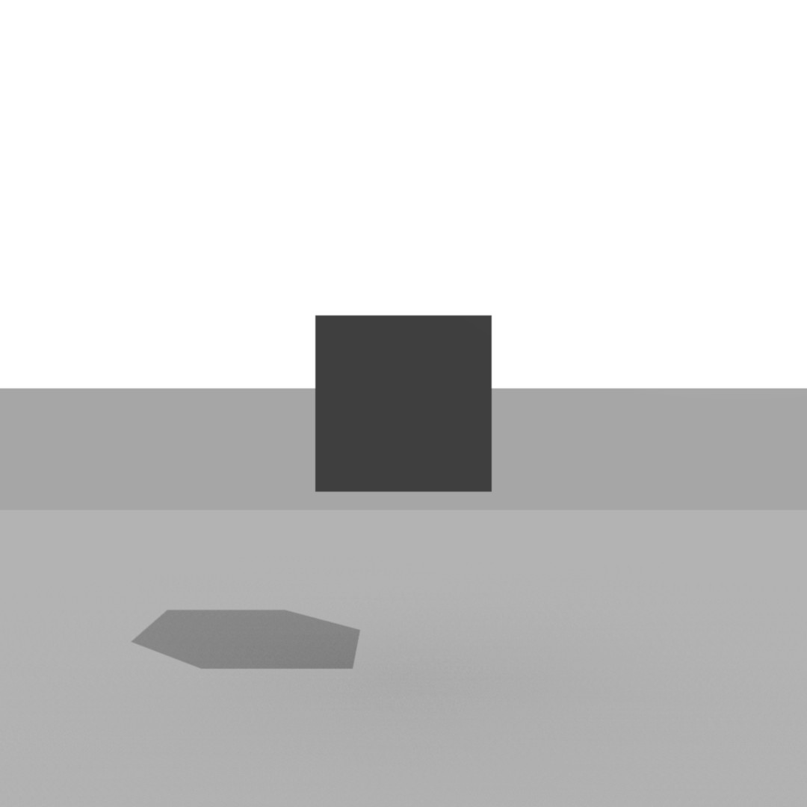
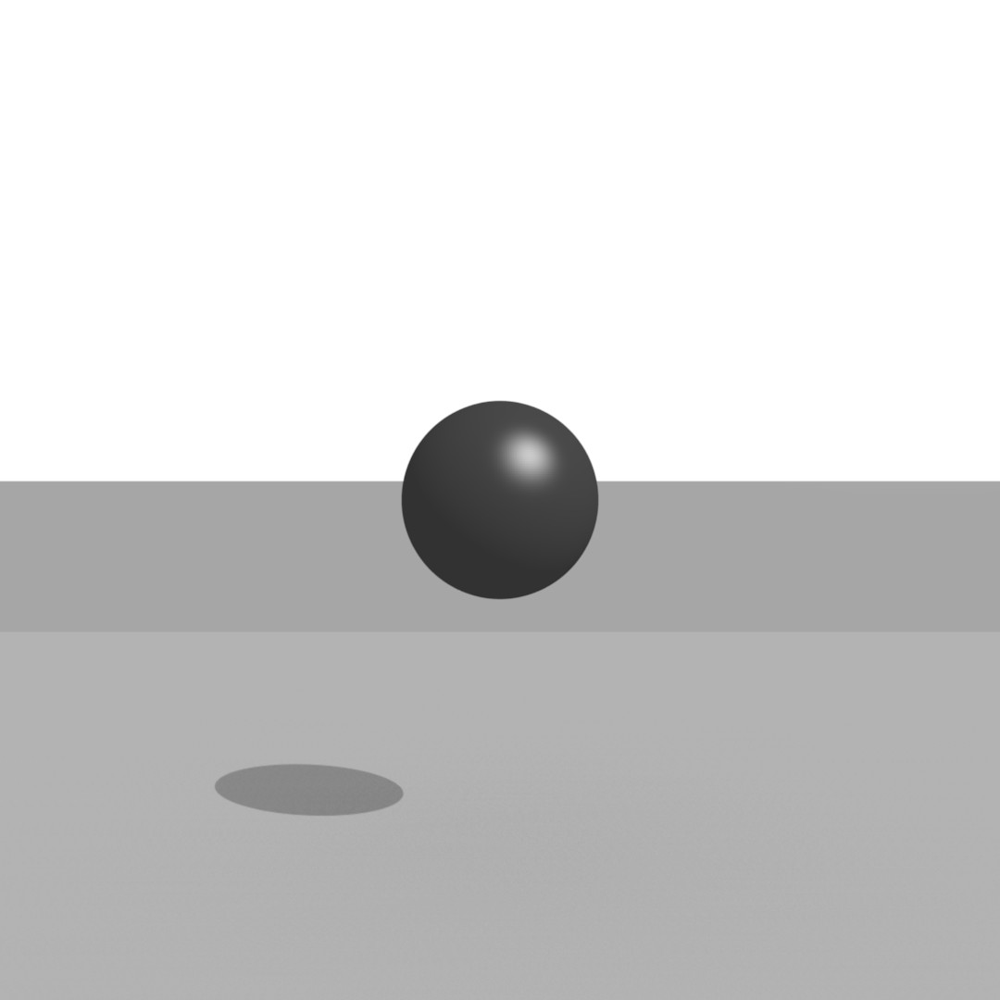
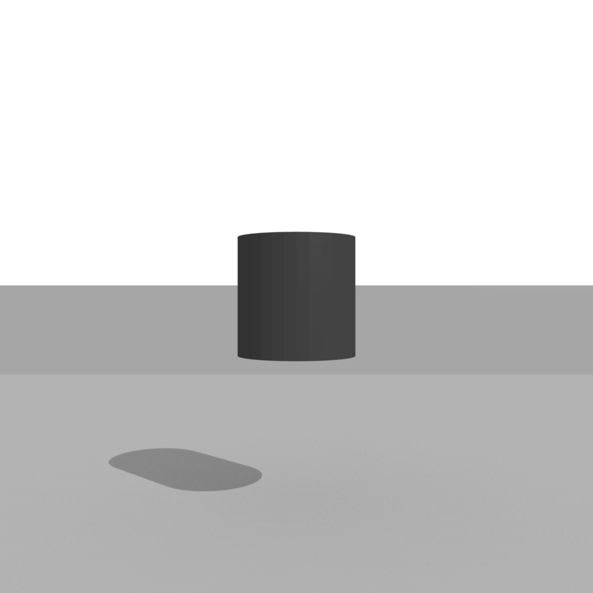
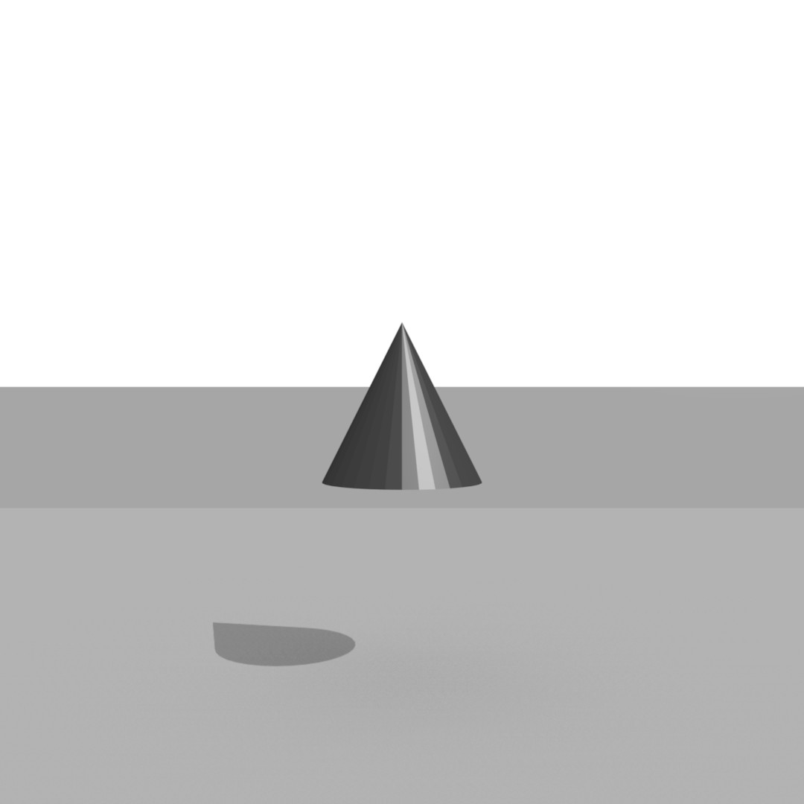
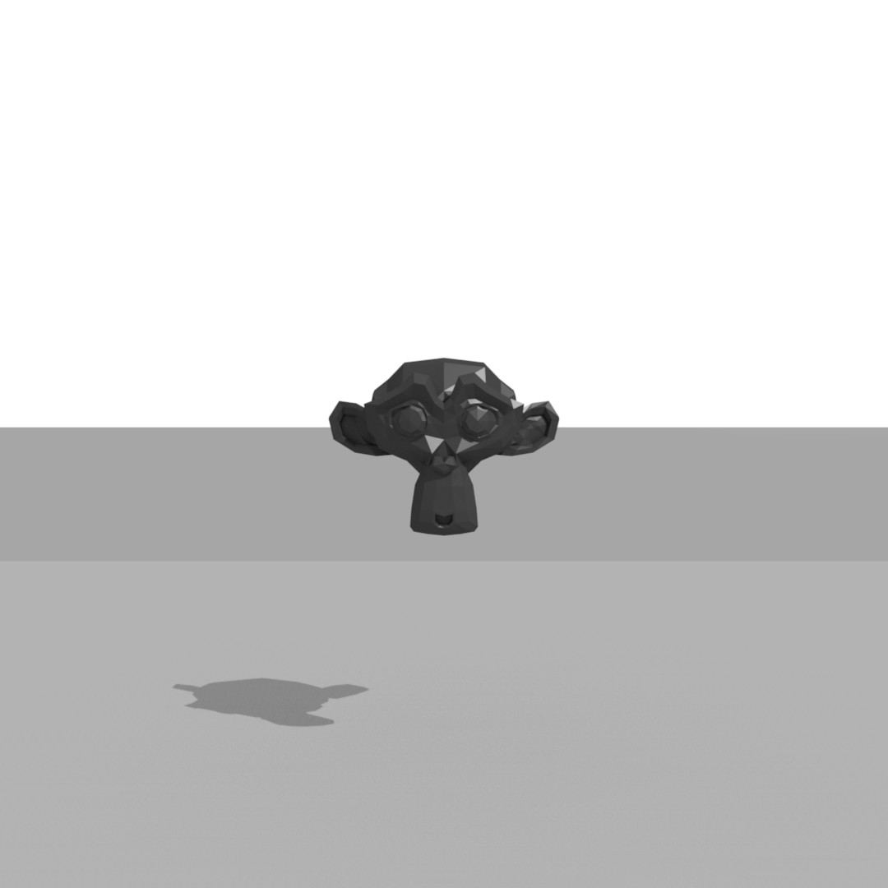

# ShapeCentral

A simple dataset consisting of simple objects in various configurations, for use in demos of machine learning and object recognition.

## Use

To run this code, specify your settings in shape_central.py and run the following:

```bash
blender --background 'shape_central.blend' --python 'shape_render.py'
```

## Shapes

|                                                              |                                                           |                                                             |
| :----------------------------------------------------------: | :-------------------------------------------------------: | :---------------------------------------------------------: |
|     Cube     |  Sphere |    Torus   |
|  Cylinder |    Cone   |  Suzanne |
